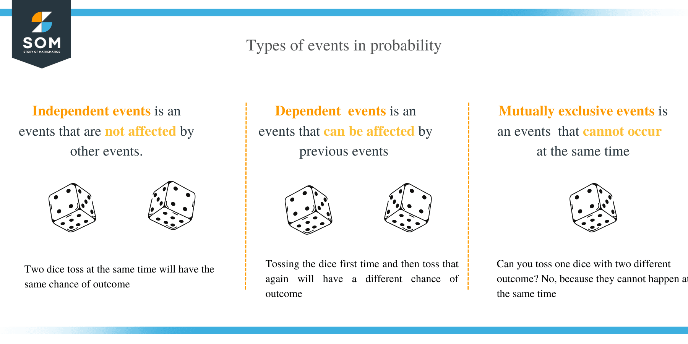

# Events 

A specific outcome or a group of outcomes from a random test or experiment.

- A single outcome can belong to many different events, which are not equally likely since they can include different groups of outcomes.

The chance of an event happening is measured with a number from **0 to 1 (or 0% to 100%)**. A score of _0 means it is impossible_. A score of _1 means it is certain to happen_.

## Main Types of Events
- _Simple Event_: 

An event that has only one single outcome (for example, rolling a 4 on a die).

- _Compound Event_: 

An event that has more than one possible outcome (for example, rolling an even number like 2, 4, or 6).

- _Independent Events_: 

The result of the first event does not affect the second event (for example, flipping a coin twice).

- _Dependent Events_: 

The result of the first event does change the chance of the second event (for example, drawing cards from a deck without putting them back).

- _Mutually Exclusive Events_: 

Two events cannot happen at the same time (for example, turning left and turning right at the exact same second).

The probability of an event using the notation **P(event)**.

# Complements
The complement of an event is everything an event is not. We denote the complement of an event with an apostrophe.

## Characteristics of complements:

* Can never occur simultaneously.

* Add up to the sample space. (A + A’= Sample space)

* Their probabilities add up to 1. (P(A) + P(A’)= 1)

* The complement of a complement is the original event. ((A’)’= A)

**Example 03.4.0**
- Assume event A represents drawing a spade, so **P(A) = 0.25**.

- Then, **A’** represents not drawing a spade, so drawing a club, a diamond or a heart. 
$$P(A’)= 1– P(A)$$

so 

$$P(A’)= 0.75.$$

