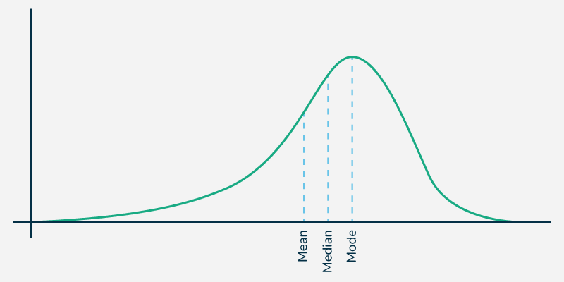

# Population 
A set of all elements of interest in a particular study. 
* This is a set of all measurements of interest.

Denoted by $N$.

# Sample 
A subset of the population.
* This is a subset of measurements selected from the population of interest.

Denoted by $n$.

* Parameter:
A numerical value that describes a characteristic of the entire population.

* Statistic 
A numerical value that describes a characteristic of a sample and used to estimate a population parameter.

* Sample statistic
A measurable characteristic of a sample 

* Population parameter
A measurable characteristic of an entire population.

* Random sampling
A sample in which every member of the population has an equal chance of being selected.

* Representative Sample
A sample that accurately mirrors the characteristics of the larger population.

* Frequency 
The number of times a particular value or category occurs in a dataset.

* Frequency Distribution Table 
A table showing the frequency of each variable.

* Measures of Central Tendency
Statistical values that represent the center or typical value of a dataset. The most common are the _mean_, _median_, and _mode_.

* Sampling variability
This describes how much as sample statistic changes across different random samples from a population.

* Distribution 
A function that shows the possible values for a variable and the probability of their occurrence.

* Sampling distribution
The probability distribution of a given statistic (like the mean or variance) based on all possible samples of a fixed size from a population.

* Hypothesis
A testable proposition or assumption about a population parameter.

* Hypothesis Test 
A test that is conducted in order to verify if a hypothesis is true or false.

* Null Hypothesis
A default hypothesis for testing. Whenever we are conducting a test, we are trying to reject the null hypothesis.

* Alternative Hypothesis
The hypothesis that contradicts the null hypothesis. It represents the researcher's claim.

* To Accept a Hypothesis
The statistical evidence shows that the hypothesis is likely to be true.

* To Reject a Hypothesis
The statistical evidence shows that the hypothesis is likely to be false.

* Estimator
The estimations we make according to a function or rule.

* Estimate
The particular value that was estimated through an estimator.

* Standard error
The standard deviation of the sampling distribution, which reflects the variability of the sample means, accounting for the sample size, with larger samples generally having smaller standard errors
$$Standard Error/SE(\bar{x}) = \frac{s}{\sqrt{n}}$$

Where: 
$s$: is _sample_

$$Standard Error/SE(\bar{x}) = \frac{sigma}{\sqrt{n}}$$
Where:
$sigma$: is _standard deviation_

* Bias 
The difference between an estimator's expected value and the true population parameter.
    - An unbiased estimator has an expected value equal to the population parameter.

## Sampling Distribution

This is the probability distribution of a given statistic (like the sample mean or proportion), calculated from multiple random samples of the same size taken from a single population.

### Measures of Central Tendency
#### Mean 
This is the simple average of the dataset
- The mean is the most widely spread measure of _central tendency_ - (a single representative value that identifies the middle or center of a data set).

- Easily affected by outliers.

Formula to calculate mean:

**_Sample Mean_**:

Used when you are calculating the average of a subset/sample of data.

$$\bar{x} = \frac{\sum x}{n}$$

Where:
* $\bar{x}$ - (x-bar): Is the symbol representing the sample mean

* ${\sum}$ - (Capital Sigma): The summation symbol. It simply tells you to "add up everything that follows."

* $x$ - Represents each individual value or data point in your dataset. 
Therefore, ${\sum x}$ means: $x_1 + x_2 + x_3 + \cdots + x_n$.

* $n$ - The total number of observations in a sample: score or data points in your dataset.

**_Population Mean_**

Used when one is calculating the average of an entire population.

$$\mu = \frac{\sum x}{N}$$

Where:
* $\mu$ - (mu): The Greek letter representing the population mean.

* ${\sum}$ - (Capital Sigma): The summation symbol. It simply tells you to "add up everything that follows."
    - Therefore, ${\sum x}$ means: $x_1 + x_2 + x_3 + \cdots + x_n$.

* $N$ - The total number of observations in a population: score or data points in your dataset.

**Example**

Imagine you measure the test scores of 5 students: 70, 85, 80, 90, and 75.

Sample Mean 

$$\bar{x} = \frac{\sum x}{n}$$

Sum all the values:

$$ 70 + 85 + 80 + 90 + 75 = 400$$

Identify $n$ (Total number of items):

$$n=5$$

Divide to find the mean ${x}$:

$$\bar{x} = \frac{400}{5} = 80$$

#### Median 

The median is the midpoint of the ordered dataset

- In an ordered dataset, the median is the number of at position 

$$\frac{n + 1}{2}$$

Example: 

Dataset = 3, 9, 15, 2, 8

- Arranged in order: 2, 3, 8, 9, 15
- Total number of items $n$: 5
- Middle Position: 
$$\frac{n+1}{2}$$

Compute:
$$\frac{5 + 1}{2}=3$$

3rd Position = 8

$$Median = 8$$

Example: 

Dataset = 10, 3, 5, 20, 18, 7

- Arranged in order: 3, 5, 7, 10, 18, 20

- Total number of items $n$: 6

- Middle Position: 
$$\frac{n+1}{2}$$

Compute:
$$\frac{6 + 1}{2}=3.5$$

3rd and 4th Position = 7 and 10 

- Average them: 

$$\frac{7 + 10}{2}=8.5$$

$$Median = 8.5$$

#### Mode 
This is the value that occurs most often.

- Mode is calculated by finding the value with the highest frequency.

A dataset can have 0 modes, 1 mode or multiple modes.

### Measure of Asymmetry

#### Skewness 
This is a measure of asymmetry that indicates whether the observations in a dataset are concentrated on one side. 

- **Right (_positive_) Skewness**
This means that the _outliers_ are to the right (_long tail to the right_).

* mean > medeian 

- **Left (_negative_) Skewness**
This means that the _outliers_ are to the left (_long tail to the left_).

* mean < medeian

Formula to calculate Skewness 

$$\gamma_1 = \frac{1}{N}\sum_{i=1}^{N}\left(\frac{x_i-\mu}{\sigma}\right)^3$$

or

$$G_1 = \frac{\sqrt{n(n-1)}}{n-2}\frac{\sum_{i=1}^{n}(x_i-\bar{x})^3}{\left(\sum_{i=1}^{n}(x_i-\bar{x})^2\right)^{3/2}}
$$

Where:

* μ = population mean

* $\bar{x}$ = sample mean

* σ = population standard deviation

* n = sample size

