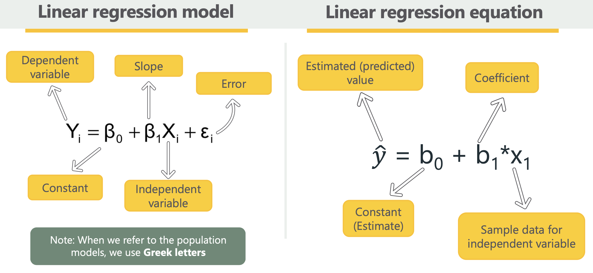
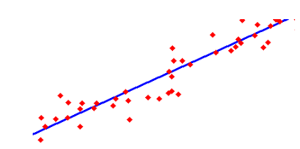
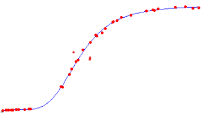
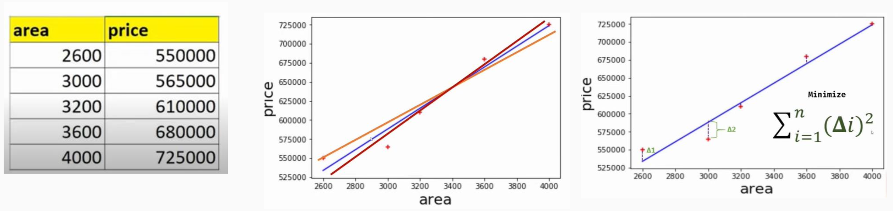
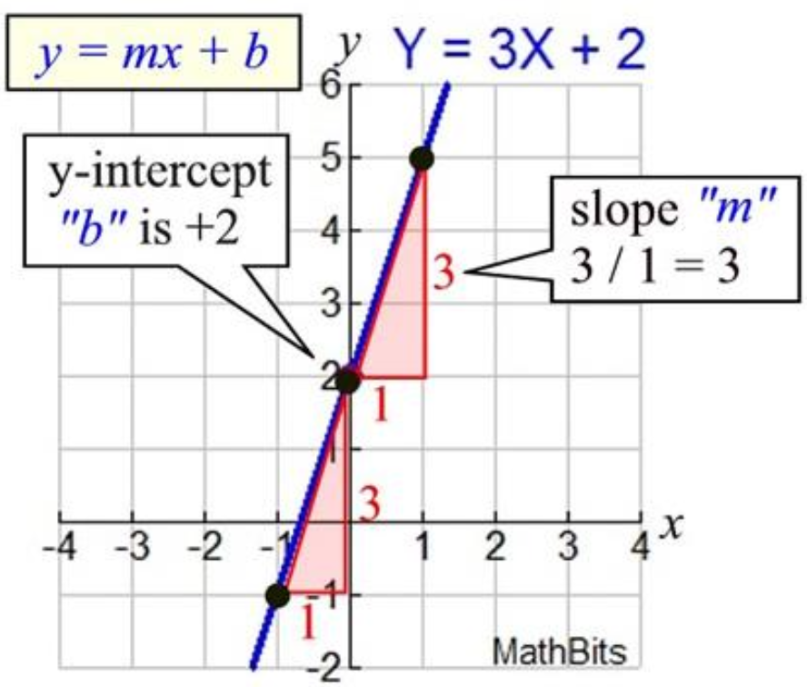
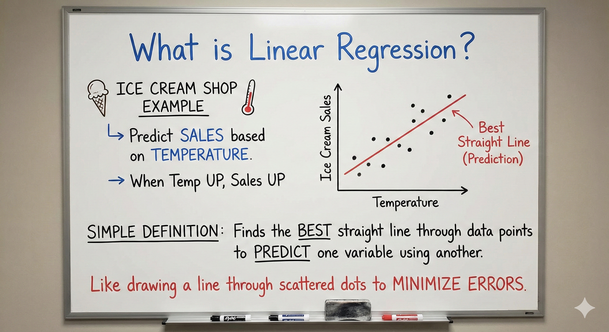
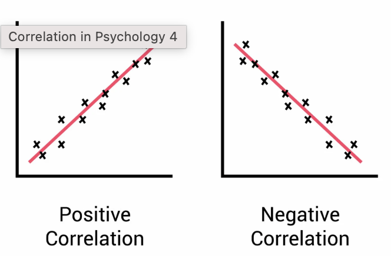
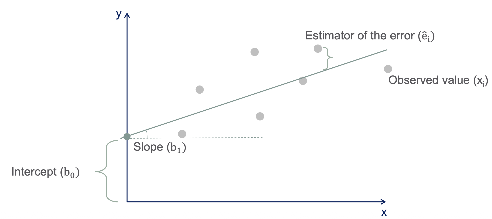
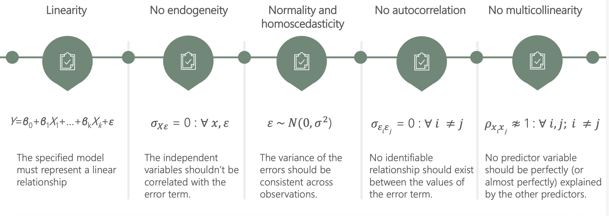

# Linear Regression 
The relationship between input variables and output variables is linear.

- This is a linear approximation of a casual relationship between two or more variables.

<div style="display: flex; justify-content: center;">
  
</div>

<p style="display: flex; justify-content: center">
Linear Regression Model and Equation.
</p>

<div style="display: flex; justify-content: center;">
  
</div>


Linear regression is further classified into:
1. Simple Linear Regression - _Only a single input variable is used to predict an output._
2. Multiple Linear Regression - _More than one input variable is involved._

_Note:_

_Nonlinear Regression_ - Output is model by a function which is a nonlinear combination of the inputs

<div style="display: flex; justify-content: center;">
  
</div>

## Simple Linear Regression 
How does Simple Linear Regression work?

- Consider the following example to explain the working of simple linear regression

<div style="display: flex; justify-content: center;">
  
</div>

_What is the price of a house having an area of 3300 square feet?_

Line representation 
$$
Y = mx + b
$$

 or 

$$
 Y = mx + c
$$


* $Y$- The _dependent variable_ (the output or vertical coordinate).

* $x$ - The _independent variable_ (the input or horizontal coordinate).

* $m$ - The _slope/gradient_ showing how steep the line is and its rise over run.

* $b$ or $c$ - The _y-intercept_, which is the starting height or the point where the line crosses the vertical y-axis at (0, value)


The equation of line in terms of area and price:
$$ price = m * area + b $$

* $price$ - The dependent variable 

* $area$ - The independent variable

<div style="display: flex; justify-content: center;">
  
</div>


Solving the for the price of 3300 square feet.

* Y = price 

* x = area 

* m = slope - slope tells us how much the target variable (dependent variable) will change as the independent variable increases or decreases.
- The slop indicates how much the dependent variable changes for every one-unit increase in the independent variable.
An exam score example shows how the slope works: if study hours $(x)$ predict a score $(y)$ via $(y = 8x + 40)$, the slope of $8$ means each extra hour of studying increases the expected score by $8$ points.

* c = intercept


Solving for m 
- Using the two nearest points, (3200, 610000) and (3600, 680000):

$$
m = \frac{Y_2 - Y_1}{X_2 - X_!}
$$

Therefore:

$$
m = \frac{680000 - 610000}{3600 - 3200}
$$

Substitute:

$$
m = \frac{70000}{400} = 175
$$

Result: 

$$
m = 175
$$


Solve for c

Using $Y = mx + c$, taking the following points, (3200, 610000)

$$
610000 = (175*3200) + c
$$

Substitute:

$$
610000 = 560000 + c
$$

Solve for c:

$$
c = 610000 - 560000
$$

Result:
$$
c = 50000
$$


Solve the equation for 330 square feet 

$Y = mx + c$

$$
Y = 175*3300 + 50000=627500
$$

Price:

$$
Y = 627500
$$


#### Note:

One can also use **Linear Interpolation**
$$
P = P_1 + \frac{(A - A_1)}{(A_2 - A_1)}(P_2 - P_1)
$$

<div style="display: flex; justify-content: center;">
  
</div>


### Linear Regression Line (Line of Best Fit)
A line that shows the relationship between the dependent and independent variables is called **regression line/line of best fit**

A regression line/ line of best fit can show two types of relationships:
1. **Positive Linear Relationship**

If the dependent variable increases on the Y-axis and the independent variables increases in the X-axis, then that is a _Positive Linear Relationship_

2. **Negative Linear Relationship**

If the dependent variable decreases on the Y-axis and the independent variable increases on the X-axis, then such a relationship is a _Negative Linear Relationship_

<div style="display: flex; justify-content: center;">
  
</div>

* The goal of linear regression if to find a straight line that minimizes the error (the difference) between the observed data points and the predicted values.

* The regression line helps predict the dependent variables for new unseen data.


### Geometrical Representation of Linear Regression  

$$
\hat y_i = b_0 + b_1x_i
$$

Where 
* $\hat y_i$ - Represents the dependent variable.

* $b_0$ - Represent the constant/estimate

* $b_1$ - Represents the slope

* $x_i$ - Represents the independent variable 

<div style="display: flex; justify-content: center;">
  
</div>

_On average the expected value of the error is 0, that is why it is not included in the regression equation._

### Minimizing the Error Using the Least Squares Method
To determine the best fit, linear regression uses the `Least Square Method`, which minimizes the difference between `actual` and `predicted values`.

**Residual** - The difference between the actual and predicted values.
Formula 
$$
Residual = y_i - \hat{y_i}
$$

Where:
$y_i$: is the actual observed value.

$\hat{y_i}$: is the predicted value from the line for that $x_i$

The LSM minimizes the sum of the squared Residuals 
$$
\sum{(y_i - \hat{y_i})^2}
$$

This method ensure that the line best represents the data where the _sum of the squared differences_ between the predicted and the actual values is small as possible.


### OLS - Ordinary Least Squares (Assumptions of Linear Regression)

One of the most common methods for estimating the linear regression equation.

However, its simplicity implies that it cannot be always used. Therefore, all OLS regression assumptions should be met before we can rely on this method

* Linearity - the relationship between input (x) and the output (Y) is a straight line.

* No endogeneity (additivity) - The total effect on Y is just the sum of effects from each X, no mixing or interaction between them.

* Homoscedasticity - The errors should have equal spread across all values of the input. 
    - If the spread changes (like fans out or shrinks), it's called _**heteroscedasticity**_ and is a problem for the model.

* Normality (Normality of Errors) - The errors should follow a normal (_bell shaped_) distribution.

* No autocorrelation - errors should not show repeating patterns especially in time-based data.

* No multicollinearity (for multiple regression) - Input variables should not be too closely related to each other. 

<div style="display: flex; justify-content: center;">
  
</div>


### Limitations 
* Assumes Linearity - The method assumes the relationship between the variables is linear. If the relationship is non-linear, linear regression might not work well

* Sensitivity to Outliers - Outliers can significantly affect the slope and intercept, skewing the best fit line.

```shell
we divide by (n - 2) because we have 2 parameters in the model that must be estimated first.

Dividing by (n - 2) mathematically corrects for this bias, ensuring that your estimate of the error variance
``` 
$\sigma^2$ is unbiased.

We divide by $n - 2$ because we have 2 parameters in the model (the intercept $\beta_0$ and the slope $\beta_1$). Estimating these two parameters "uses up" 2 degrees of freedom from your $n$ data points, leaving exactly $n - 2$ free pieces of information to estimate the error variance.


## Multiple Linear Regression (Multivariate Linear Regression)
Involves more than one independent variable and one dependent variable.

Formula 
$$
\hat{y} = \theta_0 + \theta_1{x_1} + \theta_2{x_2} + ... + \theta_n{x_n}
$$

Where:
* $\hat{y}$: is the predicted value

* ${x_1}, {x_2},..., {x_n}$: are the independent variables.

* $\theta_1, \theta_2,..., \theta_n$: are the coefficients (weights) corresponding to each predictor

* $\theta_0$: is the intercept.

The goal is to find the best fit that predicts Y accurately for given inputs X.


### Use Cases:
* Real Estate: Predict property prices using location, size and other factors.

* Finance: Forecast stock prices using interest rates and inflation data.

* Agriculture: Estimate crop yield from rainfall, temperature and soil quality.

* E-Commerce: Analyze how price, promotions and seasons affect sales.


## Evaluation Metrics of Linear Regression 


A variety of evaluation measures can be used to determine the strength of any linear regression model. These assessment metrics often give an indication of how well the model is producing the observed outputs.

* **Mean Squared Error (MSE):** Measures the average squared difference between actual and predicted values to avoid cancellation of errors.

* **Mean Absolute Error (MAE)**: Calculate the accuracy of a regression model. MAE measures the average absolute difference between the predicted values and actual values.

* **Root Mean Squared Error (RMSE)**: Square root of the residuals variance is RMSE. It describes how well the observed data points match the expected values or the model's absolute fit to the data.

* **R-Squared:** Indicates how much variation the model explains. Its value is typically between 0 and 1, but it can be negative if the model performs worse than a simple baseline model (e.g., predicting the mean).

* **Adjusted R-square:** Measures the proportion of variance explained by the model while adjusting for the number of predictors and penalizing irrelevant features.

## Regularization Techniques
* **Lasso Regression:** Regularizes a linear regression model, it adds a penalty term to the linear regression objective function to prevent overfitting.

* **Ridge regression:** Adds a regularization term to the standard linear objective to prevent overfitting by penalizing large coefficient in linear regression equation. It useful when the dataset has multicollinearity where predictor variables are highly correlated.

* **Elastic Net Regression:** Hybrid regularization technique that combines the power of both L1 and L2 regularization in linear regression objective.


