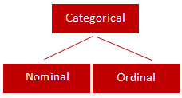

# Data Science Process 

This process includes:
```bash
 1. Reality
    |
2. Raw Data Collected 
    |
3. Data is Processed 
    |
4. Clean Dataset
    |
5. Exploratory Data Analysis
    |
6. Models & Algorithms <--- 7.Theoretical Background
    |               |    
8.  Data      Communicate Visualize Report -->Make Decisions    
    Product        
    |
9. Reality
```


# Introduction and Exploratory Data Analysis

## Types of Variables

_What is a variable?_
A variable is something that can have different values or characteristics.

The four ways to classify data in Statistics:

1. Nominal 

2. Ordinal 

3. Discrete 

4. Continuous

They are split into **Qualitative** _(Categorical)_ and **Quantitative** _(Numerical)_ types 


_What is an operational definition?_
Operational definition explains exactly how a variable or abstract concepts will be measured, observed or manipulated in a specific study or setting.

For example, instead of simply saying “stress”, you could define it operationally as:

“Stress is measured using a questionnaire with scores from _0–40_.”

_Why is it important?_
Having an operational definition is important because it:

* _Makes the variable clear_: Everyone understands exactly what you mean.

* _Makes measurement consistent_: Different researchers can measure the variable in the same way.

* _Makes the study measurable_: You can collect actual data rather than using vague concepts.

* _Improves reliability_: The same method can be repeated and should produce comparable results.

* _Allows replication_: Other researchers can repeat your study using the same definitions.

* _Reduces confusion and bias_: It prevents researchers from interpreting the variable differently.


An operational definition is important because it clearly specifies how a variable or abstract concept will be measured or classified, making the research consistent, reliable and repeatable/reproducible.

## Qualitative (Categorical) Variables 

Variables whose values fall into groups or categories.
* Contains two main subgroups
    - Nominal Variables 
    - Ordinal Variables




### Nominal Variables 

Variables whose categories are just names with no natural ordering.

Examples:
* Gender 
* Marital Status 
* Skin Colour 
* District of Birth

### Ordinal Variables (Ordered Lists)

Variables whose categories have a natural ordering.

Examples:
* Education Level 
* Performance category 
* Degree classification


## Quantitative (Numerical) Variables

These are numeric variables:

* Mathematically and structurally, they are categorized into four primary subgroups based on the intersection of these properties:


1. _Discrete Ratio Variables_: 
These are variables that consist of countable, whole numbers and have a true zero point (where zero means "none").

* Key feature: You cannot have fractions, and zero means an absolute absence of the value.

* Examples: Number of children in a family, bank account balance (in whole cents), number of hospital visits, website clicks.

2. _Continuous Ratio Variables_:
These are variables measured on a continuous scale with infinite precision and a true zero point.

* Key feature: Can include decimals/fractions, zero means "none", and you can say one value is "twice as much" as another.

* Examples: Distance, weight, height, time duration, speed.  

---

***

___

1. _Discrete Interval Variables_: 
These are variables that change in fixed, countable steps but do not have a true zero point.

* Key feature: Whole numbers only, but zero is just an arbitrary placeholder on a scale rather than a complete absence.

* Examples: Calendar years (e.g., the year 2026), shoe sizes (sizes change in distinct increments like 8, 8.5, 9, but a size "0" is just a label, not an absence of a foot).

2. _Continuous Interval Variables_:
These are variables measured on a fluid, infinite scale that lacks a true zero point.

* Key feature: Can include precise decimals, but ratios are meaningless (e.g., 40°C is not "twice as hot" as 20°C because 0°C is not absolute zero).

* Examples: Temperature (Celsius or Fahrenheit), IQ scores, GPS coordinates (latitude and longitude).


